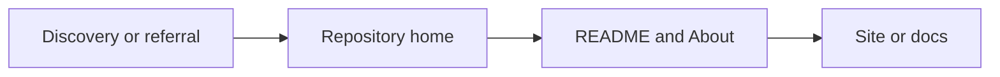

# Platforms: GitHub

Guides GitHub for parasite SEO, GEO (AI citation), and curated list creation. GitHub is a Tier 2 Technical Authority platform—high domain authority, fast indexing, very high AI citation probability. Use for repos, README, GitHub Pages, gists, and Awesome-style navigation lists.

**When invoking**: On **first use**, if helpful, open with 1–2 sentences on what this skill covers and why it matters, then provide the main output. On **subsequent use** or when the user asks to skip, go directly to the main output.

## Why GitHub for SEO

| Factor | Effect |
|--------|--------|
| **Domain authority** | High DA; repos, gists, Pages rank well |
| **Fast indexing** | Search engines crawl GitHub frequently |
| **AI citation** | ChatGPT, Perplexity cite GitHub for technical queries; Tier 2 in GEO framework |
| **Technical expertise** | Strong expertise signals; structured docs become AI reference material |
| **Cross-platform** | Share across Dev.to, Stack Overflow, forums; amplifies visibility |

## Use Cases

| Use case | Format | Purpose |
|----------|--------|---------|
| **Parasite SEO** | Repos, README, Pages, gists | Leverage GitHub authority for rankings and backlinks |
| **GEO** | Documentation, tutorials, curated lists | AI tools cite GitHub for technical answers |
| **Curated / navigation lists** | Awesome-style repos | Topic-specific resource directories; backlinks, discovery |

## Surfaces: profile vs repository

| Surface | What it is | Optimization focus |
|---------|------------|---------------------|
| **Profile README** | Public repo **with the same name as the username**; root `README.md` renders on the profile | Personal brand, flagship links, social proof |
| **Pinned** | Up to **6** repos or gists on the profile | Showcase top projects; align with entity signals (**entity-seo**) |
| **Per-repo README** | Root `README.md` on each repo’s **Code** tab | Product landing; install, proof, CTAs |

Changing a normal repo README does **not** change the profile banner unless that content is the **profile README** repo or linked from it.

### Profile README (`username/username`)

**Not the same as a product repo README.** Optimize for **identity + navigation** in ~15–40 lines of rendered content unless the user explicitly wants a long-form CV. Official setup: [Managing your profile README](https://docs.github.com/en/account-and-profile/setting-up-and-managing-your-github-profile/customizing-your-profile/managing-your-profile-readme).

| Principle | Do | Avoid |
|-----------|-----|--------|
| **Length** | Short, scannable sections; **omit ToC** unless the file is genuinely long | Applying “500–1,500 words typical for product repos” here |
| **Headings** | `###` blocks (e.g. *What I do · Open source · Find me*) for fast eyeballing | Many nested `##` + long narrative without breaks |
| **Links** | Each primary URL **once** in a **Find me / Connect** line (or badges **or** a slim table—not all three repeating the same destinations) | Duplicate site/LinkedIn/email in badges, tables, and prose |
| **Repos block** | **Bold repo name** + **≤2 short lines** + at most **one** copy-paste command (e.g. `npx skills add …`) — same scan pattern popular profiles use for “flagship OSS” without cloning the repo’s full README | Full feature matrices, changelog, or install docs pasted into the profile file |
| **Layout** | Optional **centered** header (`
`) for **name + tagline + badges only**; body stays left-aligned markdown for readability | Center-wrapping the entire README |
| **Optional widgets** | Compact Shields (flat style); optional [github-readme-stats](https://github.com/anuraghazra/github-readme-stats) / [star-history](https://star-history.com) — **third-party**, treat as **conversion/social proof**, not core SEO | Wall of `for-the-badge` badges when the same CTAs are repeated in text |

**Minimal outline (typical profile):**

1. Title + answer-first tagline (+ slim badge row).
2. `### What I do` — identity, proof link(s), **without** repeating the same URLs again later.
3. `### Open source` — bold repo links + pitches + optional one code fence.
4. `### Find me` — single line of deduped links (site · bio · cases · social · email).
5. `### Activity` (optional) — small **github-readme-stats** + **star-history**; **alt text** on ``.

Reference pattern (high-signal, low-noise): scan-first profiles such as [alchaincyf](https://github.com/alchaincyf) — short `###` blocks, bold product/repo names, one “find me” cluster.

**Entity hub pattern:** When the person has a canonical site, lead with it in the **opening line** and mirror the same URL in **Pinned** / **profile About** (if used) so **site ↔ GitHub OSS** stay aligned for **entity-seo**.

### Profile README checklist (short)

- [ ] H1 + **one** answer-first tagline (keywords: role, stack, domain)
- [ ] Canonical **outbound** links (site, social, email) **deduplicated**
- [ ] **Pinned** repos (≤6) match the story told in the README
- [ ] Optional: **Activity** section — group stats / star-history under one heading instead of scattering widgets
- [ ] **Last updated** footnote for freshness (GEO signal)

## Repository home: layout map

| Area | Typical contents | SEO / ops note |
|------|------------------|----------------|
| **Main column** | File list; rendered **root README** below | First screen and H2/H3 carry most narrative |
| **About sidebar** | **Description**, **Website**, **Topics**, releases shortcut, license, languages | Keep Description and README first paragraph consistent; **Website** should match the primary outbound CTA |
| **Other tabs** | Issues, PRs, Actions, etc. | Engagement and freshness signals |

**Website field**: Maintained via repo **Settings** / **About** edit; prefer one canonical docs or product URL aligned with README links.

## In-site discovery (high level)

| Entry | Role | Caveat |
|-------|------|--------|
| **Trending** | Time-windowed visibility | Formula is **not** public; never promise ranking |
| **Explore** | Collections, themes, programs | Useful for patterns and seasonal campaigns |
| **Topics** | Topic pages tied to repository topics | Aligns with Topics metadata (see Topics section below) |
| **Search** | Query across repos and users | README + About + topics drive match quality |

UI and URLs evolve; verify on [github.com](https://github.com/).

## Repository Name, About & README (SEO/GEO Priority)

**Ranking weight** (GitHub + Google): Repository name & About ≈ highest; Topics ≈ high; README ≈ high.

### Repository Name

| Practice | Guideline |
|----------|-----------|
| **Descriptive** | Hint at what the project does |
| **Keyword-rich** | Include primary keywords (`markdown-editor` not `my-project`) |
| **Hyphens** | Separate words (`react-component-library`) |
| **Concise** | Shorter = memorable, shareable |

### About Section (Description)

| Limit | Guideline |
|-------|-----------|
| **350 chars** | Hard limit; GitHub enforces |
| **~128 chars** | Optimal for brevity; often displayed fully |
| **Content** | Primary keyword + natural variations; what it does, who it's for; link to website or docs if space |

**Example**: "A fast, lightweight markdown editor for React with live preview, syntax highlighting, and export to PDF. Built with TypeScript."

### Topics

| Limit | Guideline |
|-------|-----------|
| **6–20 topics** | Max 20; 6–10 recommended |
| **~50 chars** each | Per topic |
| **Format** | Lowercase, hyphens, numbers only |
| **Mix** | Technology (react, python), purpose (cli, library), category (seo, ai-tools), community (hacktoberfest) |

**Underutilized** but highly effective for discoverability and GEO.

### README Structure & Components

Targets **repository (project) READMEs** unless noted. **Profile README** overrides: shorter, fewer sections—see **Profile README (`username/username`)** above.

| Section | Purpose | SEO/GEO |
|---------|---------|---------|
| **Title + tagline** | H1 + 1–2 sentence summary; keywords in first paragraph | Critical; first 100 words weighted |
| **Table of contents** | Links to H2/H3; **for long repo READMEs** (often >500 words). **Usually skip on profile README** | Navigation; crawlability |
| **Installation / Quick start** | Prerequisites; exact commands; copy-paste ready | Use-case clarity |
| **Usage examples** | Code blocks; common scenarios | Citable; extractable |
| **Screenshots / GIFs** | Demo, output; alt text required | Engagement; accessibility |
| **Badges** | Build, version, license | Trust signals |
| **Contributing** | Link to CONTRIBUTING.md | Community signal |
| **License** | Link to LICENSE | Completeness |

**Word count**: No hard limit; **500–1,500 words** typical for **product / library** repos. Lead with value; expand later. **Profile README**: prefer **dense brevity**—long-form belongs on the canonical site or in pinned repos’ own READMEs.

### README GEO / AI Citation

| Practice | Guideline |
|----------|-----------|
| **Answer-first** | Direct answer in first 1–2 sentences (40–60 words); **profile README** may compress to **one punchy tagline under H1** if outbound links carry the rest |
| **Short paragraphs** | 2–3 sentences max; extractable clarity |
| **Question-style headings** | H2/H3 as questions where relevant (**repository READMEs**); on **profile README**, optional — clarity of **sections** matters more than question phrasing |
| **Data inclusion** | Stats, numbers; cited content ~40% more likely to include data |
| **Freshness** | Update regularly; ~76% of cited content updated within 30 days |

**Entity signals**: Clear project name, author, maintainer; consistent identity. See **entity-seo**.

### README Checklist — **repository (default)**

- [ ] Project title with keywords
- [ ] Concise description in first paragraph
- [ ] H2/H3 structure; alt text for images
- [ ] Installation + usage examples
- [ ] Screenshots or demo
- [ ] Badges; Contributing; License
- [ ] Internal links to related docs/repos
- [ ] 6–20 topics on repo

*(For **profile** `username/username`, use the shorter **Profile README checklist** under Surfaces—not every row above applies.)*

## Parasite SEO on GitHub

### Key Surfaces

| Surface | Use |
|---------|-----|
| **README** | Landing page for repo; keyword-optimized summary, headings, links |
| **GitHub Pages** | Static site; blog, FAQ, docs; additional ranking opportunities |
| **Gists** | Micro-content; long-tail keywords; link to repos or external resources |
| **Wiki** | Keyword-rich documentation |
| **Issues** | Q&A, discussions; indexable |

### GitHub Pages vs README

| Surface | Role |
|---------|------|
| **README** | First impression; Stars/forks; short pitch and deep links |
| **Pages** | Multi-page **static** site: long docs, blog, changelog |

**Default URL patterns**: A **user or organization site** often uses a `username.github.io` repository and serves at `https://username.github.io`. A **project site** is published from a given repo and typically appears at `https://username.github.io/repository/` (path may vary with settings). See [About GitHub Pages](https://docs.github.com/en/pages/getting-started-with-github-pages/about-github-pages).

**Limits**: Build size, bandwidth, and build-frequency caps change over time—cite [GitHub Pages limits](https://docs.github.com/en/pages/getting-started-with-github-pages/github-pages-limits) when users need numbers, not hard-coded figures from this skill.

### Optimization

| Element | Practice |
|---------|----------|
| **Repository title** | Primary keywords; descriptive; hyphens |
| **About** | 350 chars max; keyword-rich; primary keyword + natural variations |
| **Description** | Secondary keywords; link to website or resources |
| **README** | Keyword-optimized summary first; headings, bullet points; screenshots; links to docs, tutorials |
| **Topics / tags** | 6–20 relevant topics; 50 chars each |
| **GitHub Pages** | Mobile-friendly; metadata; blog/FAQ for extra keywords |

### Gists for Micro-Content

- Target specific long-tail keywords
- Link back to larger repos or external resources
- Share code snippets, small utilities

### Community Engagement

- Respond to issues and PRs; builds trust
- Contribute to popular projects; backlinks, visibility
- Keep repos updated; outdated = lower credibility

## GEO on GitHub

| Factor | Practice |
|--------|----------|
| **README clarity** | Clear, citable paragraphs; direct answers |
| **Documentation** | Structured; AI tools parse well |
| **Entity signals** | Clear project, author identity; see **entity-seo** |
| **Consistency** | Active maintenance; engagement (stars, forks, watchers) |

## Repository archetypes

| Archetype | Intent | First-screen emphasis |
|-----------|--------|------------------------|
| **Product / library** | Installable software, SDK, CLI, service | Install, quickstart, proof (CI, license), support path |
| **Curated / resource** | Awesome-style lists, indexes | Scope, curation bar, contribution rules |
| **Personal profile hub** | Public **`username/username`** README on the profile | Identity + canonical links + **pinned** flagship repos; **no** duplication of full product READMEs |

Match metrics to type: curated lists optimize for trust and backlinks; product repos optimize for adoption and issue quality.

## Curated / Navigation Lists (Awesome-Style)

**Awesome lists** = Curated, topic-specific resource lists on GitHub. Function like navigation directories; high traffic, backlinks, discovery. sindresorhus/awesome (441K+ stars) is the master list; 6,500+ curated lists exist across topics.

### Examples by Category

| Category | Examples |
|----------|----------|
| **Master list** | sindresorhus/awesome — hub of all awesome lists |
| **SEO / Marketing** | awesome-seo, awesome-ai-seo, bmpi-dev/awesome-seo |
| **AI / ML** | awesome-ai-tools, AITreasureBox, awesome-ai |
| **Dev tools** | awesome-tools, awesome-cli, awesome-nodejs |
| **Languages** | awesome-python, awesome-javascript, awesome-go |
| **Frontend / Backend** | awesome-react, awesome-vue, awesome-django |
| **Other** | awesome-security, awesome-gaming, awesome-databases |

### When to Create

- You have a niche with many quality resources to curate
- Existing lists lack coverage of your topic
- You want a backlink asset and topical authority

### List Structure (sindresorhus/awesome guidelines)

| Element | Practice |
|---------|----------|
| **Title** | Clear, focused (e.g., "Awesome SEO," "Awesome AI Tools") |
| **Description** | Succinct; scope clear |
| **Sections** | Categorized (e.g., Tutorials, Tools, Articles) |
| **Items** | Curated, not collected; only include what you recommend |
| **Item format** | `- [Name](URL) - Brief description of why it's awesome` |
| **License** | CC0 or similar |
| **Contributing** | contributing.md for PR process |

### Getting Listed vs. Creating

| Action | Use |
|--------|-----|
| **Submit to existing list** | PR to awesome-* repos; follow list format; contact maintainer |
| **Create new list** | When no list exists for your niche; follow awesome guidelines |
| **Link between lists** | Link to other awesome lists that cover subjects better |

### Discovery

- **sindresorhus/awesome** — Master list of awesome lists
- **AwesomeSearch** — Search across awesome lists
- **more-awesome** — Directory of awesome lists

## Common Mistakes

| Mistake | Avoid |
|---------|-------|
| **Ignoring engagement** | Not responding to issues/PRs reduces trust |
| **Irregular updates** | Outdated repos signal inactivity |
| **Incomplete docs** | Lack of clear descriptions frustrates users |
| **Generic titles** | Missing keywords reduces discoverability |
| **Thin awesome lists** | Low-quality or uncurated items hurt credibility |
| **Profile README = product README** | Pasting install/Contributing/screenshot-heavy templates on `username/username` — use the **profile** checklist |
| **Link sprawl on profile** | Same homepage/social/email repeated in badges, tables, and long copy — consolidate |

## Output Format

- **Use case** (parasite SEO / GEO / curated list)
- **Surface scope** (profile vs specific repository; README vs Pages)
- **Repository name, About, Topics** (if optimizing metadata)
- **Surface** (README, Pages, gist, awesome repo)
- **README structure** (sections, word count, GEO practices if applicable) — **if profile README**, cite **short** outline + deduped links + optional widgets per **Profile README** section above
- **Optimization** (keywords, structure, links)
- **Ready-to-use** copy or structure where applicable

## Related Skills

- **parasite-seo**: Parasite SEO strategy; GitHub as Tier 2 technical platform
- **generative-engine-optimization**: GEO strategy; GitHub for AI citation
- **open-source-strategy**: Open source commercialization; GitHub as primary distribution
- **directory-submission**: Directory and curated list submission; awesome lists as curated lists
- **link-building**: GitHub as link acquisition; repos, gists, awesome lists
- **entity-seo**: Entity signals (project, author); Organization, Person
