# PromptForge — End-to-End Flow & Model Guide

This document explains how PromptForge works from upload to generated image: every step, which AI model runs, what JSON is produced, and how to recreate the project from scratch.

**Stack:** Laravel 12 · Inertia + React · MySQL · OpenRouter · Local storage (`references`, `generated`)

---

## High-level pipeline

```mermaid
flowchart LR
    subgraph step1 [Step 1 — Extract Brand DNA]
        A[Upload 1–10 past posts] --> B[Vision LLM]
        B --> C[Brand DNA JSON + clusters]
        C --> D[(brand_profiles)]
    end

    subgraph step2 [Step 2 — Generate post JSON]
        E[Caption + saved profile] --> F[Cluster selector]
        F --> G[Vision LLM + cluster refs]
        G --> H[Post prompt JSON]
        H --> I[(post_prompts)]
    end

    subgraph step3 [Step 3 — Generate image]
        J[Post JSON] --> K[JsonPromptCompiler]
        K --> L[Natural-language prompt]
        L --> M[Image model + refs]
        M --> N[PNG on disk]
    end

    D --> E
    I --> J
```



| Step | Purpose | Model slug | OpenRouter model ID | Capability |
|------|---------|------------|---------------------|------------|
| **1 — Extract DNA** | Analyze past posts → reusable brand profile | `gpt-4o` | `openai/gpt-4o` | Vision chat (analyze) |
| **2 — Post JSON** | Caption + DNA → on-brand structured prompt | `gpt-4o` | `openai/gpt-4o` | Vision chat (text + optional refs) |
| **2b — Cluster pick** *(only when ambiguous)* | Pick best template cluster for caption | `gpt-4o` | `openai/gpt-4o` | Short text chat |
| **3 — Image** | Compile JSON → generate PNG | `nano-banana-2` | `google/gemini-3.1-flash-image-preview` | Image generation |

This project uses **two models only**: GPT-4o for all vision/text analysis steps, Nano Banana 2 for image generation. Slugs live in `model_configs` (seeded by `ModelConfigSeeder`); override via `.env` if needed.

### Models in use

| Slug | Name | OpenRouter ID | Used for |
|------|------|---------------|----------|
| `gpt-4o` | GPT-4o | `openai/gpt-4o` | DNA extraction, post JSON, cluster fallback |
| `nano-banana-2` | Nano Banana 2 | `google/gemini-3.1-flash-image-preview` | Image generation |

---

## Environment & config

```env
OPENROUTER_API_KEY=sk-or-...
QUEUE_CONNECTION=sync          # recommended locally — jobs run immediately

AI_DEFAULT_ANALYZER=gpt-4o
AI_DEFAULT_POST_MODEL=gpt-4o
AI_DEFAULT_GENERATOR=nano-banana-2
```

| Config key | File | Purpose |
|------------|------|---------|
| `ai.default_analyzer_slug` | `config/ai.php` | Step 1 vision model |
| `ai.default_post_model_slug` | `config/ai.php` | Step 2 post JSON model |
| `ai.default_generator_slug` | `config/ai.php` | Step 3 image model |
| `ai.prompts.extract` | `config/ai.php` | System prompt + schema for DNA |
| `ai.prompts.generate_post` | `config/ai.php` | System prompt + schema for post JSON |
| `ai.cluster_selection.*` | `config/ai.php` | Keyword threshold, max refs per cluster |

Prompt files (production copies of the Cursor skill):

| Mode | System prompt | JSON schema |
|------|---------------|-------------|
| `extract` | `resources/prompts/brand-extract-system.md` | `resources/prompts/brand-dna-schema.json` |
| `generate_post` | `resources/prompts/post-generate-system.md` | `resources/prompts/post-prompt-schema.json` |

Source of truth for prompt rules: `.cursor/skills/brand-dna-extractor/`

---

## Step 1 — Extract Brand DNA

### What it does

Upload 1–10 images of past social posts. A vision model reads all images in one request and returns:

1. **Analysis** — short prose on shared brand language
2. **DNA JSON** — brand-wide locked/flex rules + `clusters[]` (template families)
3. **Summary** — 6–10 human bullets

On success, the app auto-saves a `BrandProfile` with clusters and reference images (anchor per cluster).

### Entry points

| Method | How |
|--------|-----|
| **UI** | `/runs/create` → upload images + brand name → POST `/runs` |
| **CLI** | `php artisan brand:extract "Brand Name" img1.png img2.png` |

### Code path

```
RunController::store()
  → RunOrchestrator::createAndAnalyze()     # mode=extract, stores images on references disk
  → RunAnalysisJob
  → OpenRouterChatAnalyzer::analyze()
  → AnalysisResponseParser::parse('extract')
  → JsonSchemaValidator::validate($json, 'extract')
  → BrandProfilePersister::persistFromInvocation()   # if json_valid
```

### OpenRouter request (Step 1)

**Endpoint:** `POST https://openrouter.ai/api/v1/chat/completions`

```json
{
  "model": "openai/gpt-4o",
  "messages": [
    {
      "role": "system",
      "content": "<contents of brand-extract-system.md>"
    },
    {
      "role": "user",
      "content": [
        {
          "type": "text",
          "text": "Extract Brand DNA from these 3 reference post(s) for \"Collège LaSalle Maroc\". Group images into clusters, output DNA JSON with clusters, and a Summary. Respond with: Analysis, DNA JSON, Summary.\n\nTitle: ...\nCreative brief: ..."
        },
        { "type": "image_url", "image_url": { "url": "data:image/jpeg;base64,..." } },
        { "type": "image_url", "image_url": { "url": "data:image/jpeg;base64,..." } }
      ]
    }
  ],
  "max_tokens": 8192,
  "temperature": 0.2
}
```

### System prompt (Step 1)

Full file: `resources/prompts/brand-extract-system.md`

Key instructions:

- Treat multiple images as one brand; group into **clusters** (coherent template families).
- Mark the cleanest layout example per cluster as `is_anchor: true`.
- Output three sections in order: `### Analysis`, `### DNA JSON` (fenced JSON), `### Summary`.
- Separate **locked** rules (every future post) from **flex** rules (per-post variation).

### DNA JSON schema

Validator: `JsonSchemaValidator::validateExtractDna()`  
Schema file: `resources/prompts/brand-dna-schema.json`

**Required top-level keys:** `brand`, `rules`, `clusters`

```json
{
  "brand": {
    "name": "Collège LaSalle Maroc",
    "slug": "college-lasalle-maroc",
    "positioning": "Higher-education college in Morocco...",
    "audience": "Prospective and current students...",
    "sources": { "post_count_analyzed": 3, "notes": "..." }
  },
  "visual_identity": {
    "color_palette": {
      "primary": [{ "hex": "#4F6B27", "name": "olive green", "role": "primary" }],
      "secondary": [{ "hex": "#F2933E", "name": "warm orange", "role": "alternate dominant" }],
      "accent": [{ "hex": "#D7F23C", "name": "lime", "role": "date pill" }],
      "usage_notes": "One saturated color fills the left column each post..."
    },
    "typography": {
      "headline": "Heavy geometric sans-serif, bold, sentence case, top-left",
      "hierarchy": "Big bold headline > intro > pill-highlighted date"
    },
    "medium": "photographic + flat graphic layout",
    "composition": {
      "layout_system": "Two-zone split: color column left, rounded photo panels right"
    },
    "recurring_motifs": ["Organic squircle panels", "Lime date pill", "Logo bottom bar"]
  },
  "voice_and_copy": {
    "tone_attributes": ["warm", "encouraging", "institutional"],
    "do": ["Write in French", "Celebrate people and progress"],
    "dont": ["Be cold or jargon-heavy"]
  },
  "content_pillars": [
    { "name": "Events", "description": "Markets, ceremonies", "example_topics": ["Marché de Noël"] },
    { "name": "Workshops & learning", "description": "Creative talks", "example_topics": ["IA et création"] }
  ],
  "rules": {
    "locked": [
      "Two-zone split layout: color column left + squircle photo panel(s) right",
      "Heavy geometric bold sans-serif headline, top-left",
      "Bright lime #D7F23C pill for date/key info",
      "French copy, warm encouraging tone"
    ],
    "flex": [
      "Dominant left-column color (green, orange, beige...)",
      "Aspect ratio (1:1 or 4:5)",
      "Photo subject matter"
    ]
  },
  "clusters": [
    {
      "key": "institutional-events",
      "label": "Institutional event announcements",
      "summary": "Split layout with event photography and French headlines",
      "keywords": ["événement", "formation", "certificat", "atelier", "marché"],
      "images": [
        { "position": 0, "label": "Christmas market post", "is_anchor": true },
        { "position": 1, "label": "AI workshop post", "is_anchor": false }
      ]
    },
    {
      "key": "social-impact",
      "label": "Solidarity / donation drives",
      "summary": "Same layout system, charity-focused copy",
      "keywords": ["dons", "solidarité", "collecte", "Moyen Atlas"],
      "images": [
        { "position": 2, "label": "Donation drive post", "is_anchor": true }
      ]
    }
  ]
}
```

`position` in `clusters[].images[]` maps to upload order (0-based) and links to `run_images.position`.

### What gets saved (Step 1)

| Table | Content |
|-------|---------|
| `runs` | Upload metadata, `mode=extract`, status |
| `run_images` | Stored files on `references` disk |
| `invocations` | Raw response, metrics, `prompt_json` = DNA |
| `brand_profiles` | `dna_json`, `summary`, `slug` |
| `brand_profile_clusters` | `key`, `label`, `keywords_json` |
| `brand_profile_images` | Copied paths from run, `is_anchor`, cluster FK |

---

## Step 2 — Generate on-brand post JSON

### What it does

Given a saved brand profile and a caption/topic, the app:

1. **Selects a cluster** (keyword match on caption; small LLM call if ambiguous)
2. Attaches that cluster's **anchor + up to 2** reference images
3. Sends DNA JSON + caption + refs to a vision LLM
4. Parses **On-brand check**, **JSON Prompt**, **Tweaks**
5. Saves structured post JSON to `post_prompts`

### Entry points

| Method | How |
|--------|-----|
| **UI** | `/post-prompts/create` → pick profile, enter caption → POST `/post-prompts` |
| **CLI** | `php artisan brand:generate college-lasalle-maroc --caption="..." --generator=nano-banana` |

### Code path

```
PostPromptController::store()
  → PostPromptService::generate()
  → PostGenerationJob
  → OpenRouterPostGenerator::generate()
      → ClusterSelector::select()        # keyword score + optional model pick
      → buildInstruction() + ref images
  → AnalysisResponseParser::parse('generate_post')
  → JsonSchemaValidator::validate($json, 'generate_post')
  → post_prompts row updated
```

### Cluster selection (Step 2a — no vision, optional)

**When:** Multiple clusters exist AND (top keyword score &lt; 0.15 OR top two scores within 0.05).

**Model:** Same as `AI_DEFAULT_POST_MODEL` (`gpt-4o`)

```json
{
  "model": "openai/gpt-4o",
  "messages": [
    {
      "role": "system",
      "content": "Pick the single best cluster key for a new social post. Reply with ONLY the cluster key string, nothing else."
    },
    {
      "role": "user",
      "content": "Caption: Remise des certificats...\nTopic: (none)\nClusters: [{\"key\":\"institutional-events\",\"label\":\"...\",\"keywords\":[...]}]"
    }
  ],
  "max_tokens": 64,
  "temperature": 0
}
```

**Image picking:** Anchor first, then others until `max_images_per_cluster` (default 3). Override with `--cluster_key=` or explicit `reference_image_ids` in flex JSON.

### OpenRouter request (Step 2)

```json
{
  "model": "openai/gpt-4o",
  "messages": [
    {
      "role": "system",
      "content": "<contents of post-generate-system.md>"
    },
    {
      "role": "user",
      "content": [
        {
          "type": "text",
          "text": "Generate one on-brand post JSON prompt.\n\nTarget generator: nano-banana\nChosen cluster: Institutional event announcements (institutional-events)\nCluster keywords: [\"événement\",\"formation\"]\nAttached reference images: 2\nCaption: Cours du soir — inscrivez-vous maintenant\n\nBrand DNA JSON:\n{ ... full dna_json ... }\n\nRespond with: On-brand check, JSON Prompt, Tweaks."
        },
        { "type": "image_url", "image_url": { "url": "data:image/jpeg;base64,..." } }
      ]
    }
  ],
  "max_tokens": 8192,
  "temperature": 0.3
}
```

### System prompt (Step 2)

Full file: `resources/prompts/post-generate-system.md`

Key instructions:

- Enforce every `rules.locked` item in output `brand_locked`.
- Output JSON per `post-prompt-schema.json`.
- **Nano Banana tuning:** rich `post.concept` sentence, hex codes, short headlines, "match attached reference layout."
- **ChatGPT Image tuning:** spell every `on_image_text` with font/weight/color/position.

### Post prompt JSON schema

Validator: `JsonSchemaValidator::validatePostPrompt()` (relaxed — accepts `quality.must_have` as alias for `include`; `post.concept` is the hard requirement for image gen)

Schema file: `resources/prompts/post-prompt-schema.json`

**Required:** `meta`, `brand_locked`, `post` (with `concept`), `quality` (with `include` or `must_have`)

#### Canonical example (strict schema)

```json
{
  "meta": {
    "brand": "Collège LaSalle Maroc",
    "post": "1/1",
    "target_generator": "nano-banana",
    "aspect_ratio": "1:1"
  },
  "reference_usage": "Match the attached reference layout exactly: left color column, right squircle photo panel, lime date pill, logo bottom bar. Replace only subject and headline copy.",
  "brand_locked": {
    "palette": [
      { "hex": "#4F6B27", "role": "dominant column (flex per post)" },
      { "hex": "#D7F23C", "role": "date pill accent" },
      { "hex": "#FFFFFF", "role": "headline text on dark" }
    ],
    "typography": "Heavy geometric bold sans-serif headline, sentence case, top-left in color column",
    "layout_system": "Two-zone split: solid color left column + rounded squircle photo panel(s) right + cream logo bar at bottom",
    "visual_style": "Warm documentary photography inside graphic layout panels",
    "lighting": "Natural warm soft daylight",
    "motifs": ["Lime pill for date", "ALL-CAPS category pill optional", "Logo bottom bar"],
    "post_processing": "Natural color, lightly warm, no heavy filters"
  },
  "post": {
    "concept": "A square social post promoting evening courses at Collège LaSalle Maroc. Left column in deep olive green (#4F6B27) with a bold French headline about flexible evening study. Right panel shows a warm candid photo of adult students in a modern classroom at dusk, framed in an organic squircle. A bright lime (#D7F23C) pill highlights the registration date. Bottom cream bar with Collège LaSalle Maroc logo. Mood: encouraging, professional, accessible.",
    "subject": "Adult students in evening class, laptops and notebooks, warm interior lighting",
    "content_pillar": "Academic milestones",
    "on_image_text": [
      {
        "text": "Votre avenir, à votre rythme",
        "role": "headline",
        "font_style": "Geometric sans-serif",
        "weight": "Bold",
        "color": "#FFFFFF",
        "alignment": "left",
        "position": "Top-left of green column"
      },
      {
        "text": "COURS DU SOIR",
        "role": "label",
        "font_style": "Geometric sans-serif",
        "weight": "Bold",
        "color": "#1A1A1A",
        "alignment": "left",
        "position": "ALL-CAPS pill below headline"
      },
      {
        "text": "INSCRIPTIONS · 15 SEPT.",
        "role": "cta",
        "font_style": "Geometric sans-serif",
        "weight": "Bold",
        "color": "#1A1A1A",
        "alignment": "center",
        "position": "Inside lime #D7F23C pill"
      }
    ],
    "caption": "Les cours du soir au Collège LaSalle Maroc s'adaptent à votre emploi du temps. Rejoignez une communauté engagée et construisez votre avenir, à votre rythme. ✨",
    "hashtags": ["#CollègeLaSalleMaroc", "#FormationContinue", "#CoursDuSoir"]
  },
  "quality": {
    "include": [
      "photorealistic documentary photography",
      "crisp vector graphic layout",
      "exact hex colors",
      "legible French typography",
      "organic squircle photo mask",
      "warm natural lighting"
    ],
    "avoid": [
      "cartoon or illustration style",
      "wrong layout (centered text over full-bleed photo)",
      "missing lime date pill",
      "illegible or misspelled French text",
      "cold corporate stock photo look",
      "extra logos or watermarks"
    ]
  }
}
```

#### Alternate LLM shape (also accepted)

Models sometimes return slightly different keys. The compiler and relaxed validator handle:

- `quality.must_have` instead of `quality.include`
- `on_image_text` as nested object (`headline`, `subhead`) instead of array
- `reference_usage` as `{ "instruction": "..." }` instead of string
- Flat keys inside `brand_locked` (`layout`, `typography_hierarchy`, etc.)

Image generation only requires `post.concept` to be present and non-empty.

### Expected model response format (Step 2)

```markdown
### On-brand check
DNA locked rules enforced: split layout, lime pill, French warm tone...

### JSON Prompt
```json
{ ... post prompt JSON ... }
```

### Tweaks
- Try dominant orange column instead of green for variety
- Add a second stacked photo panel on the right
```

---

## Step 3 — Generate image

### What it does

1. **Compile** post JSON → natural-language prompt (`JsonPromptCompiler`)
2. Load cluster reference images (anchor + up to 2)
3. Call **Nano Banana 2** with `modalities: ["image", "text"]`
4. Decode base64 image from response
5. Store PNG on `generated` disk; update `post_prompts.image_path`

### Entry points

| Method | How |
|--------|-----|
| **UI** | `/post-prompts/{id}` → **Generate image (Nano Banana 2)** |
| **Code** | `PostPromptService::dispatchImageGeneration($postPrompt)` |

### Code path

```
PostPromptController::generateImage()
  → PostPromptService::dispatchImageGeneration()
  → PostImageGenerationJob
  → JsonPromptCompiler::compile($prompt_json)
  → OpenRouterImageGenerator::generate($compiled, $referencePaths)
  → Storage::disk('generated')->put(...)
```

### Compiled natural-language prompt (example)

The compiler flattens JSON into paragraphs the image model reads directly:

```
A square social post promoting evening courses at Collège LaSalle Maroc. Left column in deep olive green (#4F6B27) with a bold French headline about flexible evening study. Right panel shows a warm candid photo of adult students in a modern classroom at dusk, framed in an organic squircle...

Layout: Two-zone split: solid color left column + rounded squircle photo panel(s) right + cream logo bar at bottom

Typography: Heavy geometric bold sans-serif headline, sentence case, top-left in color column

Color palette (use these exact hex codes): #4F6B27 (dominant column), #D7F23C (date pill accent), #FFFFFF (headline text)

On-image text (spell exactly, legible typography):
- "Votre avenir, à votre rythme" (headline, Geometric sans-serif, Bold, #FFFFFF, top-left)
- "COURS DU SOIR" (label, Bold, #1A1A1A, ALL-CAPS pill)
- "INSCRIPTIONS · 15 SEPT." (cta, Bold, #1A1A1A, lime pill)

Aspect ratio: 1:1

Quality keywords: photorealistic documentary photography, crisp vector graphic layout, exact hex colors...

Avoid: cartoon or illustration style, wrong layout, missing lime date pill...

Reference usage: Match the attached reference layout exactly...
```

### OpenRouter request (Step 3)

**No system message** — user message only, with compiled text + reference images.

```json
{
  "model": "google/gemini-3.1-flash-image-preview",
  "messages": [
    {
      "role": "user",
      "content": [
        { "type": "text", "text": "<compiled natural-language prompt>" },
        { "type": "image_url", "image_url": { "url": "data:image/jpeg;base64,..." } },
        { "type": "image_url", "image_url": { "url": "data:image/jpeg;base64,..." } }
      ]
    }
  ],
  "modalities": ["image", "text"],
  "image_config": {
    "aspect_ratio": "1:1",
    "image_size": "2K"
  }
}
```

### OpenRouter response (Step 3)

Image bytes are read from:

```
choices[0].message.images[0].image_url.url   → data:image/png;base64,...
```

Fallback paths: `message.content` as array with `image_url` parts, or raw `data:image/...` string.

Stored at: `generated/post-prompts/{id}/nano-banana-2-{uuid}.png`

Served via: `GET /post-prompts/{id}/image`

---

## Database tables (brand flow)

```
users
  └── brand_profiles (dna_json, summary, slug)
        ├── brand_profile_clusters (key, label, keywords_json)
        │     └── brand_profile_images (path, disk, is_anchor)
        └── post_prompts (caption, prompt_json, image_path, metrics)
              └── brand_profile_cluster_id  ← set during post generation

runs (mode=extract)
  ├── run_images
  └── invocations → prompt_json holds DNA during extraction
```

### Key `post_prompts` columns

| Column | Step | Description |
|--------|------|-------------|
| `status` | 2 | `pending` → `processing` → `completed` / `failed` |
| `prompt_json` | 2 | Structured post JSON from LLM |
| `json_valid` | 2 | Strict schema check (image gen still allowed if concept exists) |
| `brand_profile_cluster_id` | 2 | Cluster chosen for this caption |
| `image_status` | 3 | `pending` → `processing` → `completed` / `failed` |
| `compiled_prompt` | 3 | Natural-language prompt sent to image model |
| `image_path` / `image_disk` | 3 | Generated PNG location |

---

## UI routes

| URL | Step |
|-----|------|
| `/runs/create` | 1 — upload & extract |
| `/runs/{id}` | 1 — view extraction results |
| `/post-prompts/create` | 2 — new post from profile |
| `/post-prompts/{id}` | 2 + 3 — view JSON, generate & preview image |

---

## Console commands

```bash
# Step 1 — extract DNA from images (sync queue)
php artisan brand:extract "Brand Name" post1.png post2.png --notes="Optional brief" --model=gpt-4o

# Step 2 — generate post JSON
php artisan brand:generate college-lasalle-maroc \
  --caption="Your caption" \
  --generator=nano-banana \
  --model=gpt-4o \
  --aspect=1:1

# Verify OpenRouter
php artisan ai:ping
php artisan ai:ping --model=openai/gpt-4o
```

Step 3 has no dedicated artisan command — call `PostPromptService::dispatchImageGeneration()` or use the UI.

---

## How to recreate this project

### 1. Scaffold

```bash
composer create-project laravel/laravel promptforge
cd promptforge
composer require inertiajs/inertia-laravel
php artisan breeze:install react
npm install && npm run build
```

### 2. Database

Create migrations for: `model_configs`, `compare_presets`, `runs`, `run_images`, `invocations`, `brand_profiles`, `brand_profile_clusters`, `brand_profile_images`, `post_prompts`.

Seed `ModelConfigSeeder` with `gpt-4o` (analyze, default) and `nano-banana-2` (generate, default).

### 3. OpenRouter layer

- `OpenRouterClient` — HTTP client with `Authorization: Bearer`
- `OpenRouterChatAnalyzer` — vision chat for Step 1
- `OpenRouterPostGenerator` — vision chat for Step 2
- `OpenRouterImageGenerator` — `modalities` + `image_config` for Step 3

### 4. Prompt layer

Copy from `.cursor/skills/brand-dna-extractor/` into `resources/prompts/`:

- `brand-extract-system.md`
- `brand-dna-schema.json`
- `post-generate-system.md`
- `post-prompt-schema.json`

Implement `SkillPromptBuilder`, `AnalysisResponseParser`, `JsonSchemaValidator`, `JsonPromptCompiler`.

### 5. Orchestration

- `RunOrchestrator` + `RunAnalysisJob` + `BrandProfilePersister`
- `PostPromptService` + `PostGenerationJob` + `ClusterSelector`
- `PostImageGenerationJob`

Use `QUEUE_CONNECTION=sync` for local dev.

### 6. Storage

Configure disks in `config/filesystems.php`:

- `references` → `storage/app/references`
- `generated` → `storage/app/generated`

Run `php artisan storage:link`.

### 7. Frontend (Inertia)

- `Runs/Create`, `Runs/Show` — Step 1
- `PostPrompts/Create`, `PostPrompts/Show` — Steps 2 & 3

Show page: display JSON, "Generate image" button when `post.concept` exists, image preview when `image_status === completed`.

### 8. Tests to verify

```bash
php artisan test --filter=BrandDna
php artisan test --filter=PostImageGeneration
php artisan test --filter=JsonPromptCompiler
php artisan test --filter=JsonSchemaValidator
```

---

## Architecture diagram (services)

```
┌─────────────────────────────────────────────────────────────────┐
│                        Inertia React UI                          │
└────────────┬───────────────────────────────┬────────────────────┘
             │                               │
     RunController                   PostPromptController
             │                               │
     RunOrchestrator                 PostPromptService
             │                               │
     RunAnalysisJob                 PostGenerationJob ──► PostImageGenerationJob
             │                               │                      │
 OpenRouterChatAnalyzer          OpenRouterPostGenerator    JsonPromptCompiler
             │                      ClusterSelector                  │
             │                               │              OpenRouterImageGenerator
             └───────────┬───────────────────┴──────────────────────┘
                         │
                  OpenRouterClient
                         │
                  OpenRouter API
```

---

## Troubleshooting

| Symptom | Likely cause | Fix |
|---------|--------------|-----|
| Run stuck on "processing" | Queue not running | Set `QUEUE_CONNECTION=sync` or run `php artisan queue:work` |
| No brand profile after extract | DNA JSON failed validation | Check invocation `json_validation_errors` on run show page |
| "Generate image" button hidden | Missing `post.concept` | Re-run post generation or fix JSON |
| `image_status: failed` | OpenRouter returned no image | Check `storage/logs/laravel.log`; verify model ID and API key |
| `json_valid: false` but JSON looks fine | Schema drift (`must_have` vs `include`) | Safe to generate if `post.concept` is present (current behavior) |

---

## Related files

| Path | Role |
|------|------|
| `app/Services/AI/OpenRouter/OpenRouterChatAnalyzer.php` | Step 1 API call |
| `app/Services/AI/OpenRouter/OpenRouterPostGenerator.php` | Step 2 API call |
| `app/Services/AI/OpenRouter/OpenRouterImageGenerator.php` | Step 3 API call |
| `app/Services/Brand/ClusterSelector.php` | Step 2 cluster logic |
| `app/Services/Brand/BrandProfilePersister.php` | Step 1 DB save |
| `app/Services/Prompt/JsonPromptCompiler.php` | Step 3 JSON → text |
| `app/Services/Prompt/JsonSchemaValidator.php` | Validates DNA + post JSON |
| `database/seeders/ModelConfigSeeder.php` | All model slugs & OpenRouter IDs |
| `.cursor/skills/brand-dna-extractor/brands/*.json` | Example saved DNA profiles |

---

*Last updated: 2026-06-04 — reflects Phase 2 complete (extract → post JSON → Nano Banana 2 image).*
